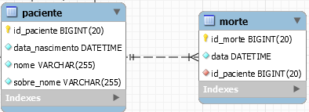
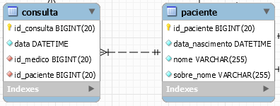

# spring-boot-poc-hps

Proof of concept on the discussion "for CPJ-Java Programmers Community", running and sloppy implementation.
# Requirements
* Spring Boot 2.x
* Java 11
* Lombok

# :baby: Baby steps 
* Spring Data (Query native)
* H2
* Import
* JPA
* MySql
* jUnit4

# :baby: Baby JPA
 * When we have a dependency @OneToOne or @ManyToOne, the ideal and that we use types of load EAGER both classes are intrincically coupled
 
     

    
* By default when the relationship is annotated with @OneToMany or @ManyToMany it is loaded in Lazy mode ie when we have done any type of search in the PacienteEntity.class entity it will not be loaded together with the entity ConsultaEntity.class.
 
     

# Current Version
0.1
____
Pedro Polonea